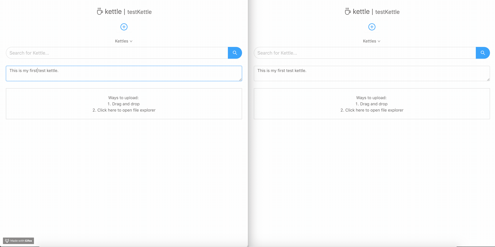

# Kettle - An instant-updating, auth free, cloud storage platform.
__Key Features__
+ Create unauthenticated "buckets" called Kettles that allow you to store text and images.
+ Live updating using Google's Firebase platform
+ Ability to see list of all Kettles, or directly access a Kettle via `kettle.herokuapp.com/kettle_name`

__Preview__

_Two separate browser instances running Kettle from Heroku (i.e. not local)._
